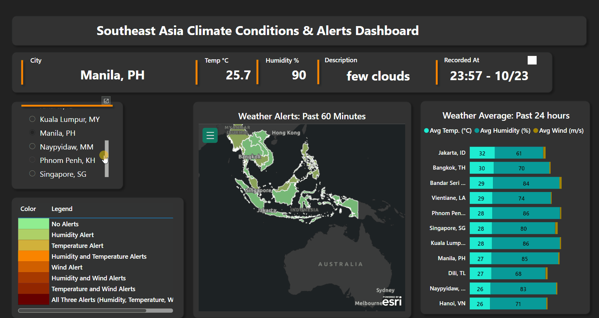

# Power BI Report Insights & Accessibility

## Southeast Asia Climate Conditions & Alerts Dashboard

This dashboard provides hourly updated climate data and alerts for Southeast Asian countries. Key features include:

- **City-Specific Climate Data**: View the latest hourly temperature, humidity, and weather descriptions for any selected city in the region.

- **Weather Alerts Map**: Visualize weather alerts from the past hour across the region. The color-coded system indicates the severity and type of alerts, such as humidity, temperature, or wind-related alerts.

- **24-Hour Weather Averages**: See the average temperature, humidity, and wind speed for all Southeast Asian countries based on the last 24 hours of hourly data.

## Accessing the Full Report:
The full interactive report is hosted on Power BI Service with specific access restrictions for data security reasons. Direct access is not available to the public. However, if you're interested in a detailed walkthrough or have any inquiries about the report, please feel free to [contact me](mihaicrt12@gmail.com). 

